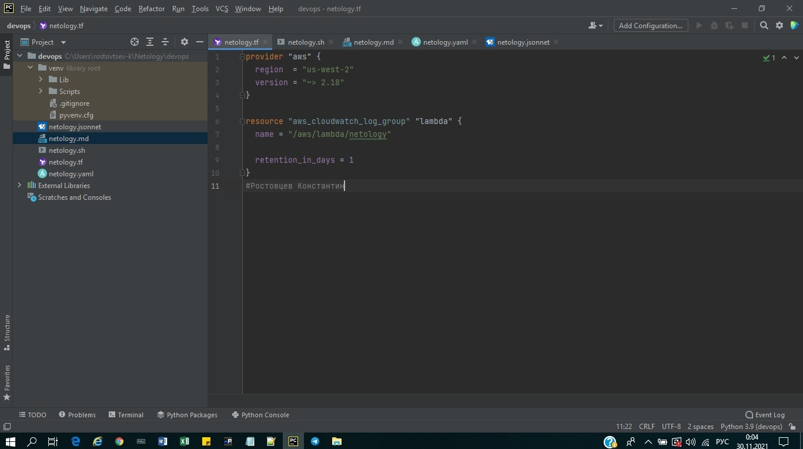
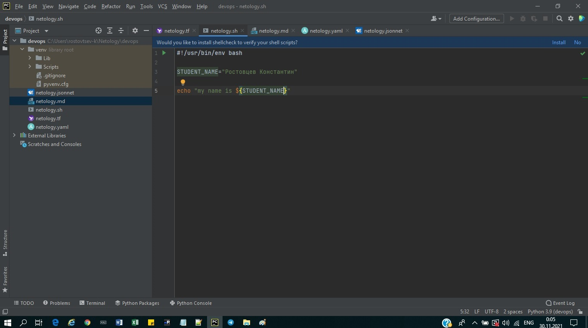
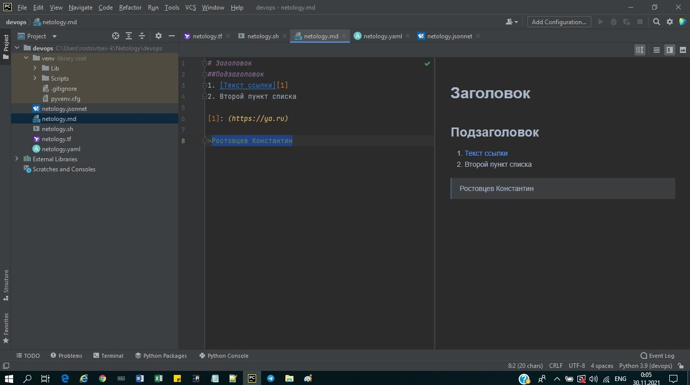
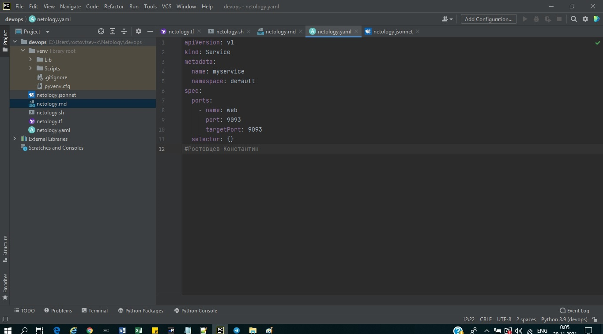
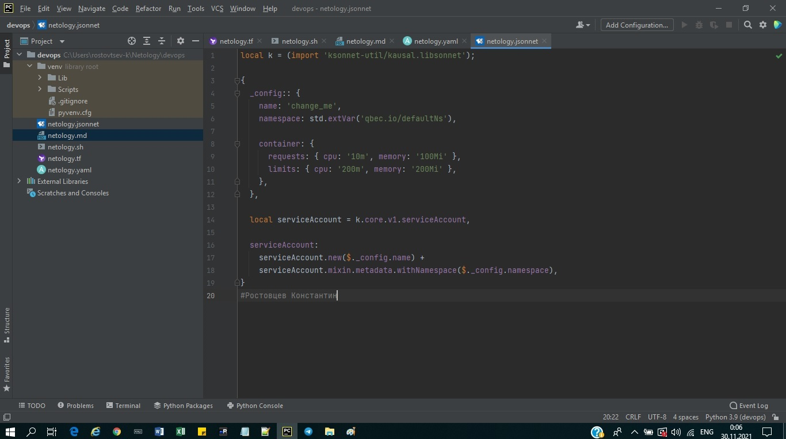

# 1.1. Введение в DevOps — Константин Ростовцев
___

### Задание №1

- Terraform:

- Bash:

- Markdown:

- Yaml:

- Jsonnet:

### Задание №2

**1. Коммуникаация**

>***Роль DevOps - максимально наладить коммуникации между 
участиками процесса (devs,qas,ops,managers,customers)***

- Наладить систему куда пишут доку, релизят, апрувят(Система управления версиями)
- Наладить систему для постановки задач(Система управления проектами)

**2. Разработка**

>***Роль DevOps - унифицировать одинаковую среду для 
> всех участинов разработки.***
- Выбор инструментов для разработки (напр. PyCharm)
- Тестирование(Сестему для отслеживания сделанных тестов разработчиком, Система для проведения код-ревью и получения результатов теста)

**3. Внешние интеграции**

>Роль DevOps -  Лицензирование, соглашение, поддержка.

- Разобраться с лицензированием либ, фреймворков на предмет правомерного использования.
- Следить за соглашением о модели взаимодействий(планирование между всеми участниками создания максимально универсальной внешней интеграции(легкий переход на другую версию, нет необходимости поддерживать старые версии))
- Поддержка изменений для плавного развития продукта(любые будущие изменения должны быть обратносовместимы со стырыми системами)

**4. Инфраструктура**
>***Роль DevOps - планирование\выбор\поддержка оптимального\отказоустойчивого решения***

- Развертывание нескольких площадок
- Поддержка (автоматическая подстройка инфраструктуры под нагрузки, адаптация под новые задачи(инфраструктура как код для максимального удобства в дальнейшем использовании(обновление, миграция и т.д.)

**5. Тестирование**
>***Роль DevOps - максимально возможно автоматизировать процесс тестирования.***

- Юнит тестирвоание (отдельные блоки)
- Функциональное тестирование(поднятие тестовых сред\запуск тестов\рассылка уведомлений)
- Интеграционное тестирование(поднятие тестовых сред\запуск тестов\рассылка уведомлений)
